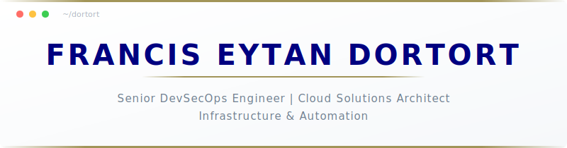

  <picture>
    <source media="(prefers-color-scheme: dark)" srcset="assets/header-dark.svg">
    <source media="(prefers-color-scheme: light)" srcset="assets/header-light.svg">
    
  </picture>

  
  
  
  

 

<table>
  <tr>
    <td width="50%" valign="top">

### &nbsp;&nbsp;What I Do

☁️ Architect cloud infrastructure on AWS 
🔒 Lead DevSecOps practices and CI/CD pipelines 
🛠️ Build developer tooling and automation 
✍️ Write about infrastructure and operations

</td>
    <td width="50%" valign="top">

### &nbsp;&nbsp;Stack & Credentials

  
  
  
  
  
  
  
  

</td>
  </tr>
</table>

  <picture>
    <source media="(prefers-color-scheme: dark)" srcset="assets/divider-dark.svg">
    <source media="(prefers-color-scheme: light)" srcset="assets/divider-light.svg">
    
  </picture>

## Current Projects

<!-- CURRENT_PROJECTS_START -->
- [agent-bound](https://github.com/dortort/agent-bound) — Access control framework for MCP servers with Android-style permissions.
- [ai-tool-guard](https://github.com/dortort/ai-tool-guard) — Policy enforcement middleware for AI SDK tool calls — guards, approvals, rate limiting, and observability.
- [betterleaks-action](https://github.com/dortort/betterleaks-action) — GitHub Action for Betterleaks secrets detection - scan for exposed credentials in your CI/CD pipeline.
- [claude-code-scheduler](https://github.com/dortort/claude-code-scheduler) — Schedule recurring AI tasks with Claude Code using cron and natural language.
- [dgossgen](https://github.com/dortort/dgossgen) — Generate dgoss container test suites from Dockerfiles via static analysis.
- [gemini-actions](https://github.com/dortort/gemini-actions) — A collection of GitHub Actions powered by Google Gemini that automate repository workflows.
- [keystone](https://github.com/dortort/keystone) — Open-source Electron app for AI-assisted software architecture (PRDs, TDDs, ADRs).
- [moovit-client](https://github.com/dortort/moovit-client) — TypeScript client library for Moovit public transit API (route planning, real-time arrivals, and location search).
- [openclaw-aws](https://github.com/dortort/openclaw-aws) — Infrastructure and deployment automation for OpenClaw on AWS.
- [openclaw-mailguard](https://github.com/dortort/openclaw-mailguard) — OpenClaw plugin for email prompt-injection mitigation with gated tool access.
- [skills](https://github.com/dortort/skills) — Reusable agent skills for AI tools.
- [terraform-aws-mcpgateway](https://github.com/dortort/terraform-aws-mcpgateway) — Terraform module to deploy MCP Context Forge on AWS — ECS/EKS, Fargate/EC2, Aurora/MySQL, Redis, ALB+WAF.
<!-- CURRENT_PROJECTS_END -->

  <picture>
    <source media="(prefers-color-scheme: dark)" srcset="assets/divider-dark.svg">
    <source media="(prefers-color-scheme: light)" srcset="assets/divider-light.svg">
    
  </picture>

## Latest Writing

<!-- LATEST_WRITING_START -->
- 2026-04-07 — [Closing the automation gap in Claude Code](https://dortort.com/posts/closing-the-automation-gap-in-claude-code/)
- 2026-03-09 — [Beyond terraform_remote_state: five ways to share data across Terraform configurations](https://dortort.com/posts/beyond-terraform-remote-state-five-ways-to-share-data-across-configurations/)
- 2026-02-24 — [Don't Ditch AGENTS.md — Fix What's In It](https://dortort.com/posts/dont-ditch-agents-md-fix-whats-in-it/)
- 2026-02-21 — [Agentic AI is reintroducing ClickOps](https://dortort.com/posts/agentic-operations-clickops/)
- 2026-01-08 — [dgoss: Testing the Container, Not Just the Image](https://dortort.com/posts/runtime-contract-tests-with-dgoss/)
- 2025-08-04 — [A Practical Guide to Terraform Dependency Management](https://dortort.com/posts/terraform-version-constraints/)
- 2025-07-02 — [Stop Scripting, Start Architecting: The OOP Approach to Terraform](https://dortort.com/posts/stop-scripting-start-architecting-terraform-oop/)
- 2025-06-04 — [Why GitFlow Fails at Infrastructure](https://dortort.com/posts/terraform-strategy-gitflow-vs-trunk-based/)
- 2025-05-06 — [Modernizing Scheduled Tasks: Reliability, Scale, and Zero Maintenance](https://dortort.com/posts/building-serverless-cron-on-aws/)
- 2025-04-03 — [How Serverless Shrinks PCI Scope](https://dortort.com/posts/serverless-pci-dss-scope-reduction/)
- 2025-03-04 — [Terraform at Scale: Folders, Workspaces, or Services?](https://dortort.com/posts/structuring-terraform-for-multi-environment-microservice-architectures/)
- 2025-02-10 — [Kubernetes vs. Proprietary Container Services: A Technical and Pragmatic Comparison](https://dortort.com/posts/kubernetes-vs-proprietary-container-services/)
- 2025-01-15 — [Idempotent Dockerfiles: Desirable Ideal or Misplaced Objective?](https://dortort.com/posts/idempotent-dockerfiles/)
<!-- LATEST_WRITING_END -->

  <picture>
    <source media="(prefers-color-scheme: dark)" srcset="assets/divider-dark.svg">
    <source media="(prefers-color-scheme: light)" srcset="assets/divider-light.svg">
    
  </picture>

## Activity

  <picture>
    <source media="(prefers-color-scheme: dark)" srcset="https://ghchart.rshah.org/58a6ff/dortort">
    <source media="(prefers-color-scheme: light)" srcset="https://ghchart.rshah.org/2f9e44/dortort">
    
  </picture>

